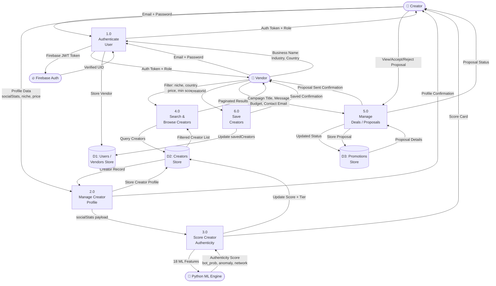
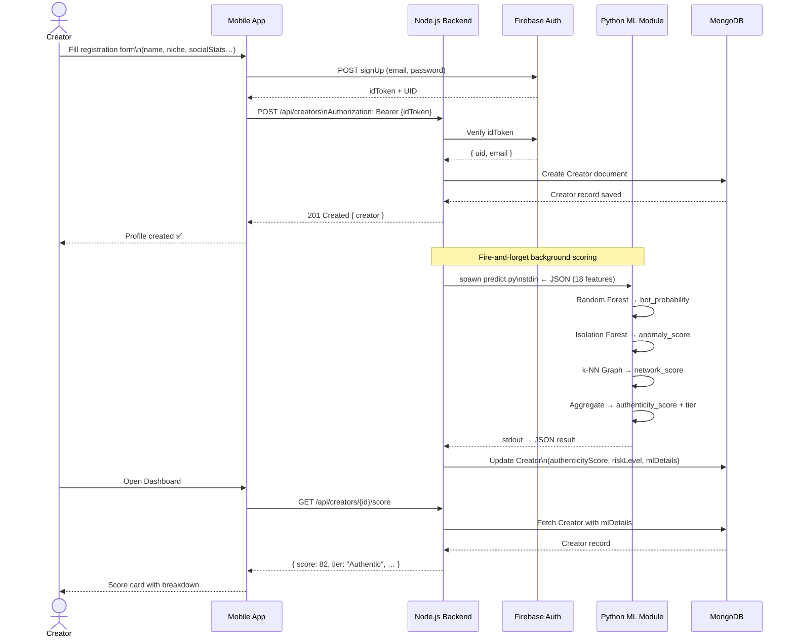
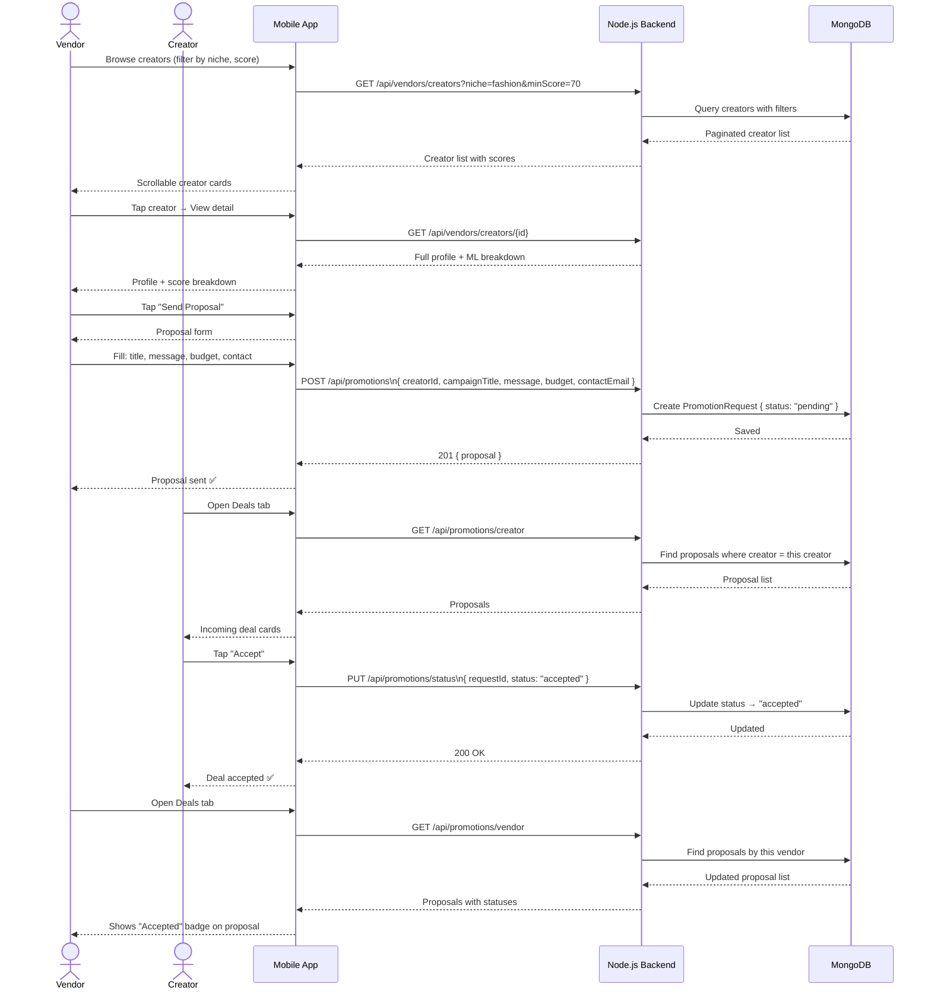
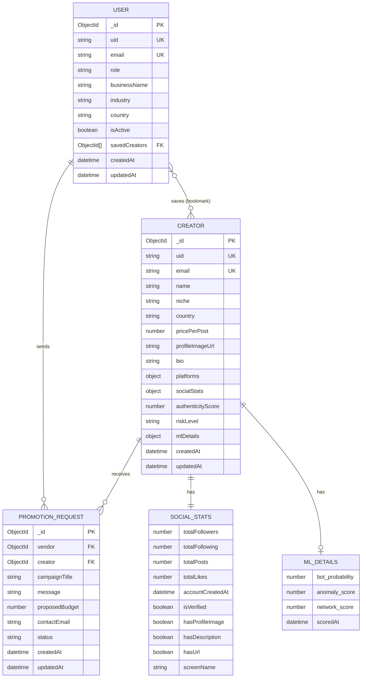

# System Diagrams — Fake Engagement Detection & Authenticity Scoring System

All diagrams use [Mermaid](https://mermaid.js.org/) syntax.  
Render them in: VS Code (Mermaid Preview extension) · GitHub · [mermaid.live](https://mermaid.live)

---

## 1. System Architecture Diagram

```mermaid
graph TB
    subgraph Client["📱 Client Layer — React Native (Expo)"]
        MOB[Mobile App<br/>MobileAppV2]
        subgraph Screens["Screens"]
            AUTH_S[Auth Screens<br/>Login / Register / RoleSelect]
            CR_S[Creator Screens<br/>Dashboard / Registration / Deals / EditProfile]
            VEN_S[Vendor Screens<br/>Browse / Saved / Deals / SendProposal]
        end
        subgraph APIs["API Layer (Axios)"]
            AUTH_A[auth.api.ts]
            CREATOR_A[creator.api.ts]
            VENDOR_A[vendor.api.ts]
            PROMO_A[promotion.api.ts]
        end
    end

    subgraph Backend["🖥️ Backend Layer — Node.js / Express (Port 5000)"]
        subgraph Middleware["Middleware"]
            FBMW[Firebase Auth Middleware]
            ROLEMW[Role Middleware]
        end
        subgraph Routes["Routes"]
            R_AUTH[/api/auth]
            R_CREATOR[/api/creators]
            R_USER[/api/users]
            R_VENDOR[/api/vendors]
            R_PROMO[/api/promotions]
        end
        subgraph Controllers["Controllers"]
            C_AUTH[Auth Controller]
            C_CREATOR[Creator Controller]
            C_USER[Users Controller]
            C_VENDOR[Vendor Controller]
            C_PROMO[Promotion Controller]
        end
        ML_SVC[ML Service<br/>ml.service.js<br/>child_process.spawn]
    end

    subgraph MLModule["🐍 ML Module — Python"]
        PREDICT[predict.py<br/>stdin → stdout]
        RF[Random Forest<br/>classifier.pkl]
        IF[Isolation Forest<br/>anomaly_model.pkl]
        NET[Network Analysis<br/>k-NN Graph]
        SCORE[Authenticity Score<br/>Aggregator]
    end

    subgraph DataLayer["🗄️ Data Layer"]
        MONGO[(MongoDB Atlas<br/>Users · Creators · Promotions)]
        FB_AUTH[(Firebase Auth<br/>UID / JWT Tokens)]
    end

    subgraph External["☁️ External Services"]
        RENDER[Render.com<br/>Deployment Host]
    end

    MOB --> AUTH_A & CREATOR_A & VENDOR_A & PROMO_A
    AUTH_A & CREATOR_A & VENDOR_A & PROMO_A --> FBMW
    FBMW --> ROLEMW --> Routes
    R_AUTH --> C_AUTH
    R_CREATOR --> C_CREATOR
    R_USER --> C_USER
    R_VENDOR --> C_VENDOR
    R_PROMO --> C_PROMO
    C_CREATOR --> ML_SVC
    ML_SVC -->|JSON via stdin| PREDICT
    PREDICT --> RF & IF & NET --> SCORE
    SCORE -->|JSON via stdout| ML_SVC
    C_AUTH & C_CREATOR & C_USER & C_VENDOR & C_PROMO --> MONGO
    FBMW -->|verify token| FB_AUTH
    Backend --> RENDER
```

---

## 2. DFD — Level 1



---

## 3. Use Case Diagram

```mermaid
graph TB
    %% Actors
    CR(["👤\nCreator"])
    VN(["🏢\nVendor"])
    ML(["🐍\nML Engine"])
    FB(["🔥\nFirebase Auth"])

    subgraph SYS["  ── Fake Engagement Detection System ──  "]

        subgraph AUTH["Authentication"]
            UC1("Register Account")
            UC2("Login")
            UC3("Select Role")
        end

        subgraph CREATOR_UC["Creator Use Cases"]
            UC4("Create Creator Profile")
            UC5("View Authenticity Score")
            UC6("Refresh ML Score")
            UC7("Edit Creator Profile")
            UC8("View Incoming Deal Proposals")
            UC9("Accept Deal Proposal")
            UC10("Reject Deal Proposal")
        end

        subgraph VENDOR_UC["Vendor Use Cases"]
            UC11("Register as Vendor")
            UC12("Browse Creators")
            UC13("Filter Creators\n(niche / country / price / score)")
            UC14("View Creator Detail\n& ML Score Breakdown")
            UC15("Send Deal Proposal")
            UC16("Edit Pending Proposal")
            UC17("Delete Pending Proposal")
            UC18("Track Sent Proposals")
            UC19("Save / Bookmark Creator")
            UC20("View Saved Creators")
        end

        %% include / extend relationships
        UC2 -. "«include»" .-> UC1
        UC3 -. "«extend»" .-> UC2
        UC6 -. "«extend»" .-> UC5
        UC7 -. "«extend»" .-> UC4
        UC13 -. "«include»" .-> UC12
        UC14 -. "«extend»" .-> UC12
        UC16 -. "«extend»" .-> UC15
        UC17 -. "«extend»" .-> UC15
        UC20 -. "«extend»" .-> UC19
        UC9 -. "«include»" .-> UC8
        UC10 -. "«include»" .-> UC8
    end

    %% Creator associations
    CR --- UC1
    CR --- UC2
    CR --- UC4
    CR --- UC5
    CR --- UC7
    CR --- UC8

    %% Vendor associations
    VN --- UC1
    VN --- UC2
    VN --- UC11
    VN --- UC12
    VN --- UC15
    VN --- UC18
    VN --- UC19

    %% System actor associations
    UC1 -. "«include»" .-> FB
    UC2 -. "«include»" .-> FB
    UC4 -. "«include»" .-> ML
    UC6 -. "«include»" .-> ML
    UC7 -. "«extend»" .-> ML
    UC5 -. "«include»" .-> ML
    UC14 -. "«include»" .-> ML
```



---

## 4. Sequence Diagram

### 4a — Creator Registration & ML Scoring



### 4b — Vendor Deal Proposal Flow



---

## 5. ER Diagram



---

> **Tip:** Paste any diagram block into [mermaid.live](https://mermaid.live) to get a PNG/SVG export.
